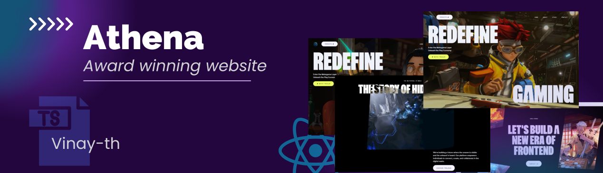
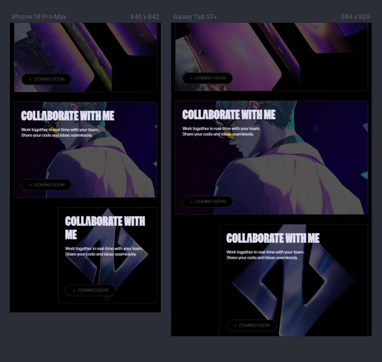

# ✨ Zentry Reimagined: An Interactive Audio-Visual Journey ✨

  
   

  

    
    
    
    
  

  <h3 align="center">Recreating the Magic of Zentry with a Personal Touch</h3>

## 🚀 Table of Contents

1. 🤖 [Introduction](#introduction)
2. 🛠️ [Tech Stack](#tech-stack)
3. ✨ [Features](#features)
4. 🏃 [Getting Started](#getting-started)
5. 📸 [Screenshots and GIFs](#screenshots)
6. 💡 [My Learnings & Challenges](#learning)
7. 👨‍💻 [Contact](#contact)

## <a name="introduction">🤖 Introduction</a>

Inspired by the captivating design and smooth animations of [Zentry](https://zentry.com/), this project is my personal take on recreating its essence. I focused heavily on harnessing the power of GSAP for sophisticated animations, crafting a seamless and engaging user experience. This project showcases my skills in TypeScript, React, and responsive design, resulting in a visually stunning and interactive website.

## <a name="tech-stack"> 🛠️ Tech Stack</a>

- **React (with TypeScript):** For building the dynamic and interactive user interface.
- **GSAP (GreenSock Animation Platform):** The heart of the animation magic, powering smooth transitions and effects.
- **Tailwind CSS:** For rapid styling and responsive design.

## <a name="features"> ✨ Features</a>

- **Dynamic Scroll-Triggered Animations:** Just like Zentry, elements come to life as you scroll, creating a captivating narrative. (Include specific examples: e.g., parallax effects, fade-in animations, morphing shapes)
- **Interactive Elements:** Engaging hover effects and click interactions enhance user immersion. (Provide examples: 3D transforms, color transitions, micro-interactions)
- **Audio-Visual Integration:** Seamlessly integrated audio and video elements enhance the storytelling and create a richer experience. (Describe how audio/video is used)
- **Responsive Design:** Enjoy a consistent experience across all devices, from desktops to mobile phones.
- **Clean Code and Component Structure:** Well-organized codebase for maintainability and scalability.

## <a name="getting-started"> 🏃 Getting Started</a>

1. **Clone the repository:** `git clone https://github.com/vinay-th/Athena.git`
2. **Navigate to the project directory:** `cd Athena`
3. **Install dependencies:** `npm install` or `yarn install`
4. **Start the development server:** `npm run dev` or `yarn dev`

## <a name="screenshots">📸 Screenshots and GIFs</a>

(Include a variety of screenshots and GIFs showcasing the key features and animations. This is essential for visually demonstrating the project's appeal.)

- **Hero Section:**  
  
- **Scroll Animation:**  
  
- **Interactive Elements**  
  
- **Mobile Responsiveness:**  
  

## <a name="learning">💡 My Learnings & Challenges</a>

- **GSAP Mastery:** Gained a deeper understanding of animating elements using GSAP, including handling 3D transformations. Improved skills with animations for interactive user experiences.
- **TypeScript Implementation:** Utilized TypeScript's type system for robust code.
  Overcame the learning curve for significant long-term benefits.
- **Performance Optimization:** Prioritized efficient animation techniques, lazy loading, and minification for optimal performance.
- **Responsive Design Considerations:** Adapted animations to different screen sizes with GSAP's responsive features.
  Thoroughly tested across devices and browsers for consistent performance and visuals.
  Implemented flexible layouts for seamless adaptation to various screen sizes.

## 🫶 Acknowledgements

- Inspiration drawn from [Zentry](https://zentry.com/).

## <a name="contact">👨‍💻 Connect with Me 

- GitHub: [@vinay-th](https://github.com/vinay-th)
- Project Link: [https://github.com/vinay-th/Athena](https://github.com/vinay-th/Athena)

---

  <h3>Built with ❤️ by Vinay</h3>

